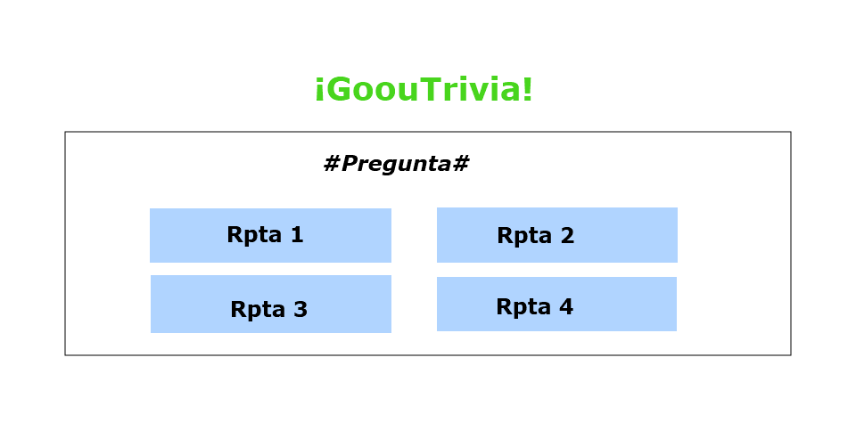

# ¡GoouTrivia!

### Descripción

En este proyecto se busca construir una trivia de preguntas, los temas que escogimos son: peliculas y música.

### Prototipo

- Primero escogimos el nombre de nuestro trivia y los dos temas: películas y música.

- Posteriormente realizamos un boceto de como queriamos que quede el primer pantallazo de la trivia en el cual se muestra el nombre de nuestro proyecto y se le pide el nombre al usuario, quedando algo asi:

- Posteriormente tambien dibujamos una vista de las preguntas con los botones de respuesta.

# Estructura

Teniendo ya la idea básica de lo que queriamos plasmar nos pusimos a trabajar. Definimos todos los elementos que usaremos en el proyecto. Los creamos en html definimos su id y su class de cada uno.

Nuestra coach nos guió para organizar nuestros elemento por secciones el HTML.

# Desarrollo

### Codeando

El primer inconveniente que tuvimos fue que al poner el nombre del usuario, este se mostrara luego en un mensaje; tras ver unos tutoriales y con la ayuda de la coach Genesis pudimos resolverlo satisfactoriamente. Aprendimos a extraer algo del HTML con el document.getElementById()

Posterior a esto continuamos trabajando en creando las funciones que aplicaran nuestros botones en JS.

En este punto ya le empezamos a dar un poco de forma y color con el CSS al proyecto. Para ambas también fue nuevo el trabajar en el CSS, pero sin mucha complicación. Emocionadas por lo que ibamos logrando, pasamos a resolver la parte de las preguntas y respuestas de la trivia.

# Resultado

Nuestro esfuerzo y nuestras ganas hicieron nacer a nuestra trivia :)!! que se ve muy parecida a como pensamos inicialmente...

# Conclusiones
### ¿Qué experimentamos?
- Sentimos un mix de emociones, por ratos alegres y encantadas, mientras por otros, paralizadas y pensativas.
- Experimentamos trabajar bajo presión, esforzarnos por querer cumplir el plazo.
- Darnos motivación entre nosotras.
- Dejamos fluir nuestros lazos de amistad.

 
### ¿Qué aprendimos?
- Entender el manejo de elementos **\<section\>, \<h\>, \<p\>, \
\, \<input\>, \<button\>, \<tabla\>** en html.
- Definir funciones en js que permitiran darle funcionalidad a nuestro botones y demas elementos.
- Manejar mucho los atributos .style.display= 'none' y .style.display ='block' para mostrar y ocultar nuestros elementos.
- Aplicar diferentes estilos mediante las class a nuestra página.

# Autores
- Andrea Borja
- Kateryn Flores
